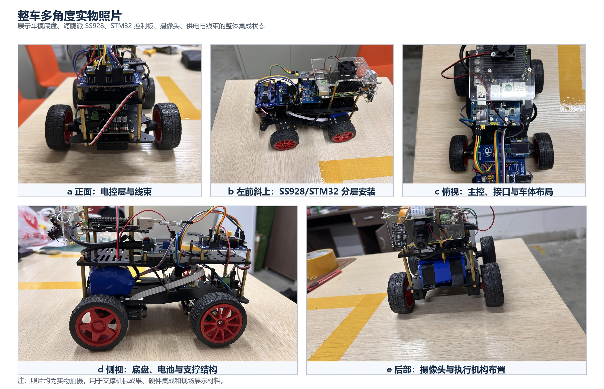
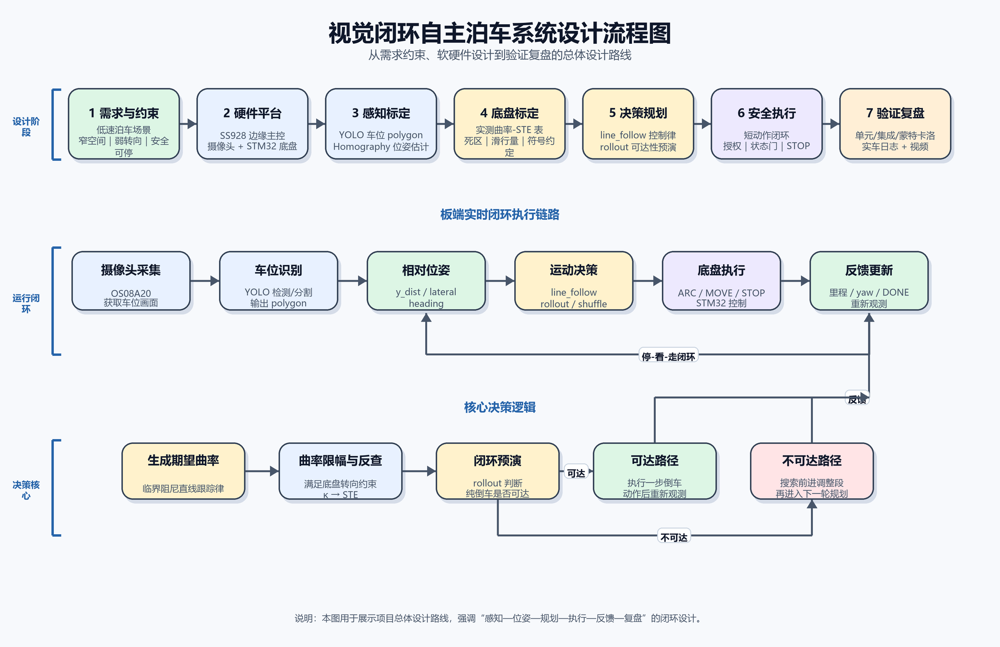
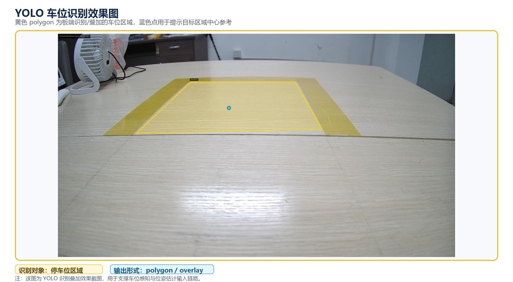
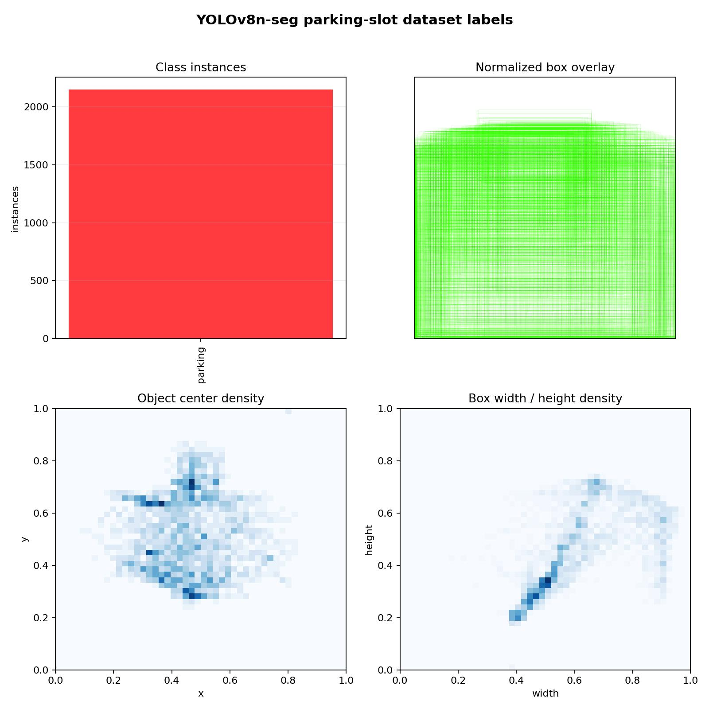
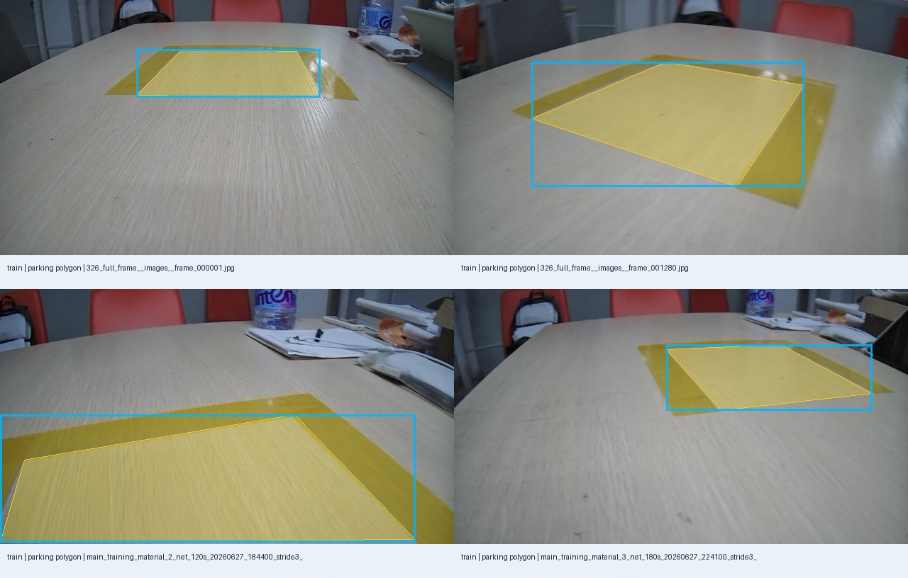
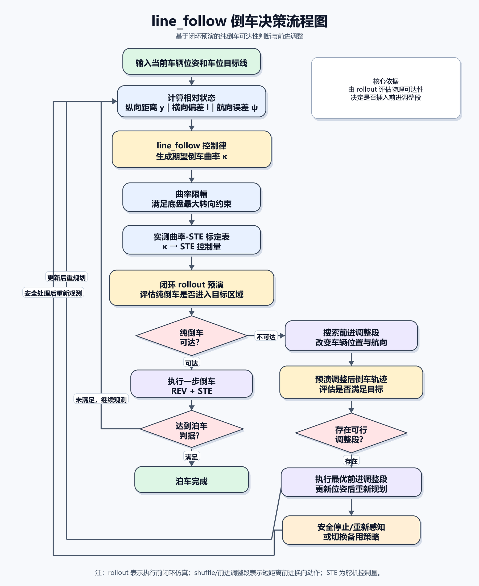
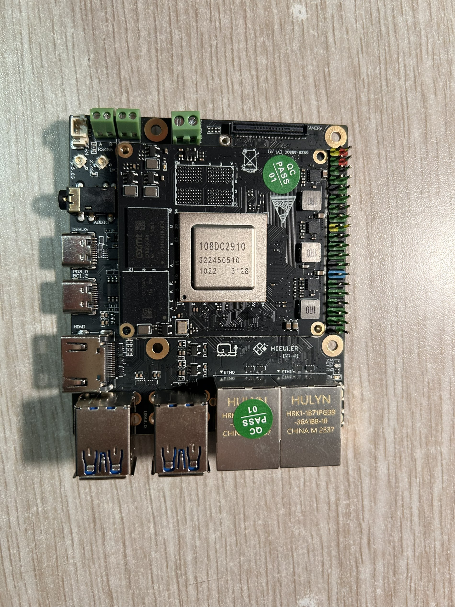
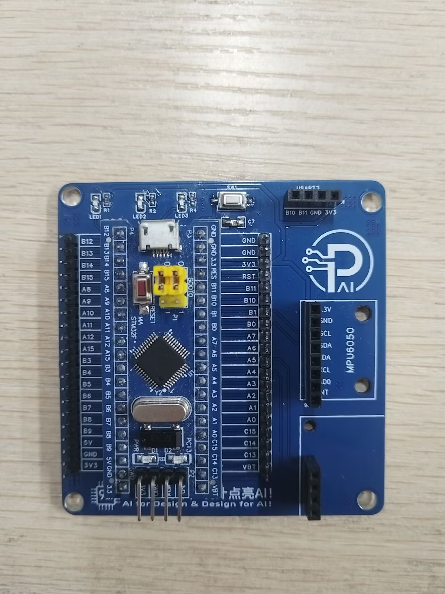
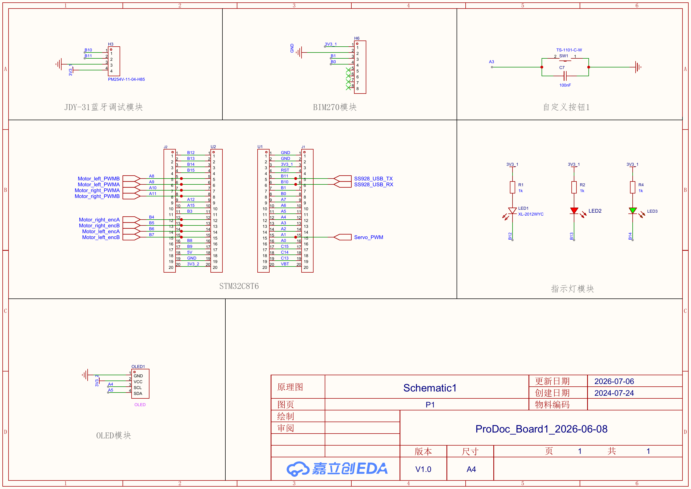
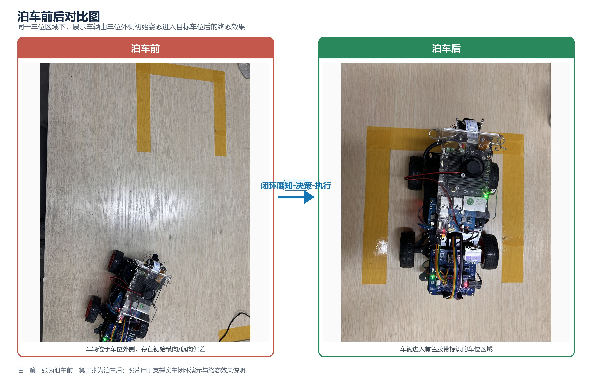

# 基于 SS928 海鸥派的视觉闭环自主泊车系统

本仓库面向项目展示与竞赛评审整理，展示一套以 **SS928 海鸥派** 为端侧主控平台、以 **OS08A20 摄像头视觉闭环** 为当前主线的低速自主泊车系统。系统通过 YOLO 识别车位区域，结合几何标定估计车辆相对车位状态，再由 `line_follow` 与 `rollout` 预演逻辑选择短动作，最终通过 STM32 下位机执行底盘动作，形成“观察、规划、执行、停车后再观察”的闭环控制流程。仓库中保留 GS1860 dToF 相关 bring-up 资料，但 dToF 暂未接入当前泊车闭环，按未实现/预留内容处理。



## 1 简介

### 1.1 项目目标

项目目标是在嵌入式端侧平台上完成视觉感知、位姿估计、泊车规划与底盘执行联动，实现低速、可验证、可人工接管的自主倒车入库能力。系统重点不是一次性执行固定动作序列，而是每次短动作后重新感知车位状态，并根据最新状态重新规划下一步。



核心控制链路如下：

```text
OS08A20 摄像头
  -> YOLO 车位识别与几何解析
  -> lateral_cm / y_dist_cm / heading_deg 等相对状态
  -> line_follow 控制律 + rollout 可达性预演
  -> STM32 串口/桥接执行底盘动作
  -> 停车后重观测并再次规划
```

### 1.2 作品特点

- 采用 SS928 海鸥派作为端侧主控，承担摄像头、网络、部署和部分推理/控制链路。
- 使用 OS08A20 摄像头获取车位画面，YOLO 模型输出车位 polygon 或叠加后的车位区域。
- 通过 Homography 将图像车位转换为纵向距离、横向偏差和航向误差。
- GS1860 dToF 仅保留为未实现的预留链路和 bring-up 参考资料，当前闭环不依赖 dToF 输出。
- 采用短动作闭环策略，执行一步、停车、重观测、再规划，降低固定脚本对现场误差的敏感性。
- 使用 STM32 下位机负责电机、舵机、串口协议和底层动作执行。
- 保留完整的离线测试、链路检查、配置文件和安全检查入口，便于复现与审阅。

## 2 功能与特性

### 2.1 视觉车位感知

系统通过摄像头采集车位画面，并使用 YOLO 模型识别车位相关区域。识别结果经过几何解析、置信度过滤和坐标转换后，生成控制器需要的相对状态量，例如横向偏差、纵向距离、航向角和视觉置信度。



YOLO 训练集采用单类 `parking` 分割标注，共整理 2299 张图像、2147 个车位实例，并保留 153 张负样本用于降低误检。仓库补充类别实例数、目标位置密度、宽高分布、标注样例，便于评审快速理解训练数据覆盖情况。





训练采用 `yolov8n-seg` 分割模型，输入尺寸 640，训练结果能够稳定分割车位区域，并为后续 Homography 位姿估计提供视觉输入。

### 2.2 dToF 预留链路（未实现）

仓库中保留了 GS1860 dToF 官方 baseline、调试脚本和 UDP 检查工具，作为后续深度感知接入的预留材料。当前自主泊车闭环未使用 dToF 深度图、UDP 深度数据或深度融合结果；当前可展示链路以 OS08A20 摄像头、YOLO 车位识别、Homography 位姿估计和 STM32 执行为主。

### 2.3 倒车决策与滚动预演

泊车规划器从当前相对状态出发，生成期望倒车曲率，并结合底盘最大转向约束和实测曲率-STE 标定表得到控制量。执行前通过闭环 rollout 预演判断纯倒车是否可达；不可达时，系统搜索前进调整段改变车辆位置与航向，再进入下一轮规划。



### 2.4 STM32 底盘执行

STM32 下位机承担电机、舵机、串口协议、传感器和底层动作执行。上位控制链路向 STM32 发送短动作指令，下位机完成具体底盘动作，并保留 STOP、状态查询和方向校验等安全相关能力。

## 3 系统组成介绍



系统由端侧计算平台、感知模块、规划控制模块和底盘执行模块组成。

```text
感知层：
  OS08A20 摄像头、YOLO 车位模型
  GS1860 dToF：预留/未接入当前闭环

端侧与桥接层：
  SS928 海鸥派、板端脚本、ROS2 bridge、UDP/串口桥接

规划控制层：
  parking_controller_core、parking_rollout_optimizer、line_follow 决策、泊车配置文件

执行层：
  STM32 下位机、电机、舵机、底盘动作协议
```

### 3.1 硬件系统

- 主控平台：SS928 海鸥派。
- 图像输入：OS08A20 摄像头。
- 深度输入：GS1860 dToF 模块为预留硬件/资料，当前未接入泊车闭环。
- 下位机：STM32 底盘执行控制器。
- 执行机构：电机、舵机及车体底盘。



硬件原理图如下，展示了主控、电机驱动、电源、传感器和接口连接关系。



### 3.2 软件系统

- `01_pc_tools/`：PC、VM、板端工具脚本，包含感知、控制、部署、调试和离线测试工具。
- `02_ros_bridge/`：ROS2 bridge 节点，覆盖 camera、YOLO、STM32 通信与泊车节点；dToF 相关内容为预留/未实现链路。
- `03_configs/`：泊车动作库、底盘模型、成功判据、视觉过滤和感知配置。
- `10_board_ss928_files/`：SS928 板端 bring-up、部署、camera 检查和系统脚本；dToF 检查脚本为未接入闭环的预留材料。
- `11_official_SS928_dtof_baseline_src/`：官方 camera + dToF baseline 源码，仅作为后续 dToF 接入参考。
- `15_stm32_lower_controller_SS928_hub/`：STM32 底盘执行下位机工程。
- `16_yolo_models/`：YOLO 车位感知模型权重与 ONNX 导出文件。

## 4 实物成果

报告中的实物图片已补充到仓库，覆盖整车多角度、板卡分层安装、摄像头与执行机构布置等展示内容。


泊车前后对比图展示了同一车位区域内，车辆从车位外侧初始姿态进入目标车位后的终态效果。



## 5 附件补充

本 GitHub 仓库定位为“重要代码 + 项目展示主页”，不单独提交 `docs/` 目录。除仓库内已展示的流程图、实物图和 YOLO 训练展示图外，以下材料作为比赛平台附件或后续补充材料单独提交：

- 作品设计报告：`嵌入式大赛作品报告_视觉闭环自主泊车系统_AiParking`。
- 演示视频：用于展示上电、识别、规划、底盘执行和泊车终态。
- 原始实物照片与过程记录：用于补充说明车辆结构、板卡安装、场地布置和调试过程。
- 其他证明材料：包括测试记录、答辩材料或比赛平台要求的补充文件。

仓库 README 仅引用当前真实存在于 `image/` 下的图片资源；后续若继续补充展示图片，应先放入 `image/`，再更新 README 引用。

## 6 代码结构

```text
.
|-- README.md
|-- image/
|   |-- cars.png
|   |-- eulerPI.png
|   |-- hardware_schematic.png
|   |-- line_follow_decision_flow.png
|   |-- parking_before_after.jpeg
|   |-- stm32.jpg
|   |-- system_design_flow.png
|   |-- vehicle_multiview_photos.jpeg
|   |-- yolo_parking_slot_detection.jpeg
|   |-- yolo_training_curves.jpg
|   |-- yolo_training_labels_distribution.jpg
|   `-- yolo_training_segmentation_samples.jpg
`-- codes/
    |-- 使用说明.md
    `-- source_code/
        |-- 00_project_root/
        |-- 01_pc_tools/
        |-- 02_ros_bridge/
        |-- 03_configs/
        |-- 04_docs_markdown/
        |-- 10_board_ss928_files/
        |-- 11_official_SS928_dtof_baseline_src/
        |-- 12_seller_dtof_reference_src/
        |-- 13_ch341_usb_serial_driver_src/
        |-- 14_vendor_root_small_scripts/
        |-- 15_stm32_lower_controller_SS928_hub/
        `-- 16_yolo_models/
```

## 7 推荐阅读顺序

1. [codes/使用说明.md](codes/使用说明.md)
2. `codes/source_code/04_docs_markdown/active_parking_control_chain_20260707.md`
3. `codes/source_code/04_docs_markdown/autopark_long_term_memory.md`
4. `codes/source_code/01_pc_tools/parking_controller_core.py`
5. `codes/source_code/01_pc_tools/parking_rollout_optimizer.py`
6. `codes/source_code/01_pc_tools/board_parking_controller.py`
7. `codes/source_code/03_configs/parking_rollout_optimizer_h1.json`
8. `codes/source_code/15_stm32_lower_controller_SS928_hub/`
9. `codes/source_code/11_official_SS928_dtof_baseline_src/sample_dtof.c`（可选：dToF 预留资料，当前未接入闭环）

## 8 复现与安全说明

### 8.1 离线代码检查

仅做源码完整性检查时，可在 PC 上执行 Python 编译检查：

```powershell
cd codes\source_code
python -m py_compile `
  01_pc_tools\parking_controller_core.py `
  01_pc_tools\parking_rollout_optimizer.py `
  01_pc_tools\parking_line_follow_decision.py `
  01_pc_tools\board_parking_controller.py
```

### 8.2 硬件与运动安全

不要在未完成车辆安全确认前直接运行自动泊车、串口执行、ROS launch、相机采集、预留 dToF 采集脚本、STM32 bridge 或任何可能驱动车辆运动的脚本。实车测试必须在低速、可人工急停、动作范围明确、环境安全的条件下进行。
