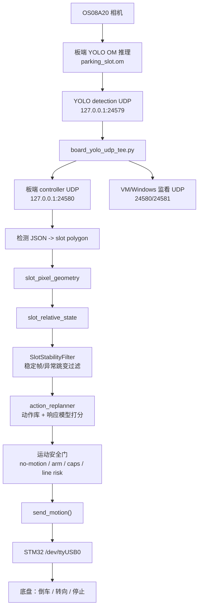
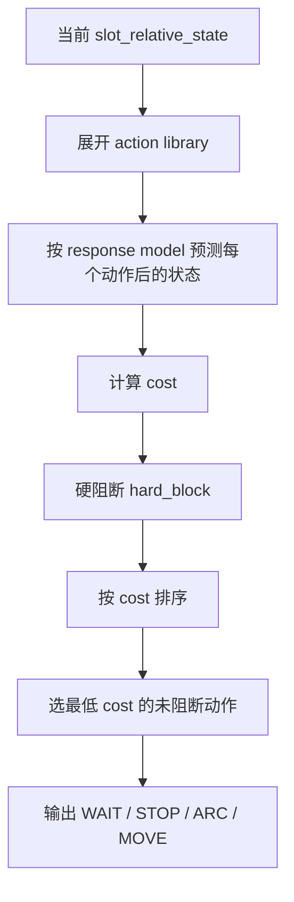

# 当前倒车泊车逻辑整理（2026-06-27）

本文档整理当前工程中**板端泊车倒车链路**的实际运行逻辑、关键配置、安全门、动作选择依据、已验证状态和当前风险点。范围以本工作区和板端已同步文件为准。

> 结论先行：当前主逻辑已经从“固定倒车序列”切换为“看见车位 -> 估计相对位姿 -> 候选动作打分 -> 执行一个短动作 -> 停车再观察再规划”。当前 L2 无运动验证通过；实车动作仍必须人工审批、武装、单步执行。

---

## 1. 关键文件位置

### 本地工程侧

```text
D:\parking_board_agent\tools\board_parking_controller.py
D:\parking_board_agent\tools\board_start_yolo_closed_loop_monitor.sh
D:\parking_board_agent\tools\board_yolo_udp_tee.py
D:\parking_board_agent\tools\parking_action_scorer.py

D:\parking_board_agent\configs\parking_action_library.json
D:\parking_board_agent\configs\parking_action_response_model.json
D:\parking_board_agent\configs\parking_success_criteria.json
D:\parking_board_agent\configs\perception_filter.json
D:\parking_board_agent\configs\chassis_kinematics.json
D:\parking_board_agent\configs\chassis_signs.json

D:\parking_board_agent\docs\autopark_long_term_memory.md
D:\parking_board_agent\docs\parking_dynamic_nomotion_check_20260627.md
D:\parking_board_agent\docs\parking_chain_runtime_guide_20260627.md
```

### 板端运行侧

```text
/opt/parking/autopark/board_parking_controller.py
/opt/parking/autopark/board_start_yolo_closed_loop_monitor.sh
/opt/parking/autopark/board_yolo_udp_tee.py
/opt/parking/autopark/parking_action_library.json
/opt/parking/autopark/parking_action_response_model.json
/opt/parking/autopark/parking_success_criteria.json
/opt/parking/autopark/perception_filter.json
/opt/parking/autopark/chassis_kinematics.json
/opt/parking/autopark/chassis_signs.json

/opt/sample/parking_yolo_seg_safe/sample_parking_yolo_rtsp_conf06_quiet_displayoff
/opt/sample/parking_yolo_seg_safe/parking_slot.om
```

---

## 2. 当前总体架构



当前 VM/Windows 只作为监看/抓包辅助，不参与闭环控制决策。真正控制闭环在板端：

```text
YOLO UDP -> board_parking_controller.py -> action_replanner -> send_motion gate
```

---

## 3. 当前设计原则

见 `D:\parking_board_agent\docs\autopark_long_term_memory.md`。

当前接受的长期方向是：

```text
YOLO slot polygon
-> relative slot pose
-> action-template library
-> score candidate actions
-> execute one short action
-> stop/observe/replan
```

因此当前倒车逻辑**不是**：

```text
固定阶段：先右打几秒 -> 回正 -> 再左打 -> 倒直线
```

而是：

```text
每次只根据当前观测选择一个短动作，动作后停止，再看一次，再规划。
```

固定 staged reverse 只保留为窄初始姿态 fallback，不是主线。

---

## 4. 坐标、符号和底盘约定

来自：

```text
D:\parking_board_agent\configs\chassis_signs.json
D:\parking_board_agent\configs\chassis_kinematics.json
```

### 4.1 符号约定

```text
yaw_cw_positive = true
odom_d_reverse_negative = false
odom_x_right_positive = true
vision_lateral_left_negative = true
```

含义：

- 顺时针 yaw 为正。
- STM32 `STAT.D` 对倒车不是负数，而更像距离幅值；不要单独把 `D` 当作前后方向符号。
- 右向位移对应 odom X 正。
- 视觉 lateral：左侧为负。

### 4.2 舵机/动作约定

当前中心舵角：

```text
servo_center_trim_ste = 100
```

当前倒车动作统一使用显式 `ARC`，即使直退也写成：

```text
ARC D=-6.0 STE=100 V=1
```

原因：避免 firmware 隐式中心和机械中心不一致。

方向经验：

```text
STE < 100 ：左弧
STE = 100 ：近似直退
STE > 100 ：右弧
D < 0     ：倒车
```

当前曲率近似：

```text
STE=60  left   r_eff≈47.64cm   deg_per_cm≈-1.2027
STE=75  left   r_eff≈95.27cm   deg_per_cm≈-0.6014
STE=105 right  r_eff≈247.22cm  deg_per_cm≈+0.2318
STE=120 right  r_eff≈86.86cm   deg_per_cm≈+0.6597
```

小距离/死区参数：

```text
arc_min_effective_cmd_cm = 3.0
arc_deadband_cm = 1.95
move_deadband_cm = 1.88
coast_after_done_cm = 0.275
```

因此小于 3cm 的 ARC 不应作为可靠实车动作。

---

## 5. 感知输入逻辑

### 5.1 YOLO 输出

板端 YOLO 输出 JSON，大致字段：

```json
{
  "component": "board_parking_yolo",
  "model": "parking_slot.om",
  "image_size": [640, 640],
  "detections": [
    {
      "class_name": "Parking",
      "confidence": 0.61,
      "bbox_xyxy": [x1, y1, x2, y2],
      "mask_polygon": [[x, y], ...],
      "mask_area_px": 120000
    }
  ],
  "detection_count": 1
}
```

控制器只接受允许的 slot class：

```text
Parking, parking, parking_slot, slot
```

必须有 `mask_polygon`，否则不能进入车位几何计算。

### 5.2 图像几何提取

核心函数在：

```text
D:\parking_board_agent\tools\board_parking_controller.py
```

关键流程：

```text
slot_infos_from_udp()
  -> detection_class_name()
  -> slot_class_allowed()
  -> slot_pixel_geometry(mask_polygon)
  -> apply_h() 透视/地面坐标估计
  -> plan(center_cm, axis_cm)
  -> assess_slot_completeness()
```

输出的核心几何字段包括：

```text
center_px
entrance_mid_px
entrance_edge_px
back_edge_px
left_edge_px
right_edge_px
approach_axis_px
axis_angle_px_deg
quad_w_px / quad_h_px / quad_area_px
center_cm
axis_yaw_deg
plan.lon / plan.lat / plan.head
```

### 5.3 车位完整性检查

当前启用：

```text
slot_completeness=ON
min_refresh_score=0.75
min_accept_score=0.45
incomplete_penalty=True
```

完整性会检查：

- mask 填充比例。
- 是否贴近图像边界。
- 入口边是否可见。
- 角度是否接近矩形。
- 对边长度是否过度不匹配。

当前实测画面中，slot 可识别，但几何完整性有时为：

```text
slot_completeness_status = suspect
slot_completeness_can_refresh_geometry = false
reasons = angle_not_rectangular, opposite_width_mismatch
```

这不是“不能运行”，但表示该帧几何不够干净，规划置信度应降低。

---

## 6. 稳定性过滤逻辑

配置：

```text
D:\parking_board_agent\configs\perception_filter.json
```

当前参数：

```text
required_frames = 5
gate_center_shift_cm = 4.0
gate_yaw_shift_deg = 8.0
gate_static_scale = 0.5
outlier_accept_consecutive = 3
hold_grace_sec = 2.5
hold_max_frames = 10
post_motion_guard_enabled = true
post_motion_guard_frames = 5
post_motion_guard_max_heading_jump_deg = 12.0
post_motion_guard_max_lateral_jump_cm = 6.0
post_motion_guard_near_y_dist_cm = 35.0
```

控制器逻辑：

```text
SlotStabilityFilter.add(info)
  -> 若样本不足 required_frames，则继续 WAIT=UNSTABLE
  -> 若新帧和已有稳定帧中心/yaw 跳变过大，则作为 outlier
  -> 连续 outlier 一致时才替换稳定簇
  -> 稳定后 fused() 用最近 N 帧中位/均值输出稳定状态
```

无检测时：

```text
SlotStabilityFilter.tick_no_detection()
  -> 如果 hold_grace_sec 内有最近稳定状态，可短暂 hold
  -> 超过 hold 或视觉丢失超时则 STOP / WAIT / no-target
```

---

## 7. slot_relative_state

`slot_relative_state()` 是当前倒车逻辑的核心观测状态。

主要字段：

```text
stable / stable_enough
confidence
pose_quality
phase_hint
slot_x_err_px
slot_entry_x_err_px
slot_heading_err_deg
slot_y_dist_cm
slot_lateral_cm
left_margin_px
right_margin_px
min_margin_px
line_risk
closeness
slot_visible_ratio
entry_edge_visible
slot_completeness_status
slot_completeness_can_refresh_geometry
```

### 7.1 当前实测姿态例子

2026-06-27 L2 无运动测试中，当前画面稳定后大致为：

```text
slot_y_dist_cm ≈ 40.5
slot_lateral_cm ≈ -5.0
slot_heading_err_deg ≈ -16.6
slot_x_err_px ≈ 68.4
slot_entry_x_err_px ≈ 57.5
min_margin_px ≈ 176
phase_hint = align_in_corridor
stable_frames = 5 / 5
```

停车标准尚未满足：

```text
slot_x_err_px_abs_max = 15
slot_heading_err_deg_abs_max = 4.0
slot_y_dist_cm_max = 10.0
min_margin_px_min = 60
required_stable_frames = 3
```

当前距离、横向误差、航向误差都还需要继续倒车修正。

---

## 8. 成功与终止条件

配置：

```text
D:\parking_board_agent\configs\parking_success_criteria.json
```

### 8.1 成功 parked 条件

```text
abs(slot_x_err_px) <= 15
abs(slot_heading_err_deg) <= 4.0
slot_y_dist_cm <= 10.0
min_margin_px >= 60
stable_frames >= 3
line_risk == false
```

全部满足才认为 parked。

### 8.2 abort / stop 条件

```text
min_margin_px < 40                         -> min_margin_below_floor
vision_lost_sec >= 0.5                     -> vision lost stop
max_total_cm > 60                          -> total cap
max_steps > 12                             -> step cap
slot_x divergence too large                -> divergence stop
line_risk == true                          -> line risk stop
```

当前还有 edge recovery 机制：

```text
edge_recovery_enabled = true
edge_recovery_min_margin_px = 30
edge_recovery_predicted_min_margin_px = 40
edge_recovery_min_margin_gain_px = 5
edge_recovery_require_x_improve = true
```

也就是说，如果已经接近边界，只有预测能改善边界余量的动作才可能被放行。

---

## 9. 动作库

配置：

```text
D:\parking_board_agent\configs\parking_action_library.json
```

当前版本：

```text
parking_action_library.v1
2026-06-22-transition-reverse-templates
actions = 10
```

动作列表：

| action_id | command | 类型 | 是否要求实测 | 允许阶段 |
|---|---|---|---|---|
| reverse_straight_6 | `ARC D=-6.0 STE=100 V=1` | 直退 | false | approach / align / straighten |
| reverse_straight_4 | `ARC D=-4.0 STE=100 V=1` | 短直退 | false | approach / align / straighten |
| reverse_left_hard_6 | `ARC D=-6.0 STE=60 V=1` | 左硬弧 | true | approach / align |
| reverse_left_hard_4 | `ARC D=-4.0 STE=60 V=1` | 左硬弧短 | true | approach / align |
| reverse_left_hard_3 | `ARC D=-3.0 STE=60 V=1` | 左硬弧微调 | true | align / straighten |
| reverse_left_soft_6 | `ARC D=-6.0 STE=75 V=1` | 左软弧 | true | approach / align |
| reverse_right_soft_6 | `ARC D=-6.0 STE=105 V=1` | 右软弧 | true | approach / align |
| reverse_right_hard_6 | `ARC D=-6.0 STE=120 V=1` | 右硬弧 | true | approach / align |
| reverse_right_hard_4 | `ARC D=-4.0 STE=120 V=1` | 右硬弧短 | true | approach / align |
| reverse_right_hard_3 | `ARC D=-3.0 STE=120 V=1` | 右硬弧微调 | true | align / straighten |

重点：

- 主体都是倒车动作，`D` 为负。
- `STE=100` 被当作显式中心直退。
- 大多数非直退动作要求 measured response，避免纯先验乱动。

---

## 10. 响应模型

配置：

```text
D:\parking_board_agent\configs\parking_action_response_model.json
```

当前状态：

```text
schema = parking_action_response_model.v2
records = 18
```

按动作分布：

```text
reverse_left_hard_6     3
reverse_right_soft_6    3
reverse_left_soft_6     2
reverse_right_hard_4    2
reverse_straight_4      2
reverse_straight_6      2
reverse_left_hard_3     1
reverse_left_hard_4     1
reverse_right_hard_3    1
reverse_right_hard_6    1
```

模型记录按 bucket 匹配当前状态，bucket 维度包括：

```text
phase
x_err_sign
x_err_bin
heading_bin
```

如果没有精确匹配，会退化为：

```text
exact bucket -> same phase/sign neighbor -> action-only neighbor -> prior
```

这也是当前风险点来源：2026-06-27 当前画面选中 `reverse_right_hard_6` 时，使用的是：

```text
origin = measured_neighbor
response_match = action_only_neighbor
confidence = 0.15
```

也就是说它不是完全命中当前姿态桶的高置信记录，而是相邻/动作级历史样本推断。

---

## 11. 动作打分逻辑

核心函数：

```text
action_replanner_command_from_state()
planner_score_actions()
planner_predicted_state()
planner_cost_state()
```

### 11.1 流程



### 11.2 cost 主要组成

`planner_cost_state()` 主要考虑：

```text
slot_x_err_abs          横向像素误差
slot_heading_err_abs    航向误差
slot_lateral_abs        地面横向估计误差
progress_bonus          纵向进展奖励
min_margin_shortfall    边界余量不足惩罚
line_risk               压线/越界高惩罚
phase_mismatch          阶段不匹配惩罚
low_confidence          响应模型低置信惩罚
uncalibrated            未校准惩罚
large_steer             大舵角惩罚
```

### 11.3 hard_block 典型原因

动作会被硬阻断的场景包括：

```text
wrong_lateral_correction_direction
predicted_line_risk
requires_measured but only prior available
phase not allowed
terminal heading guard
```

实际 hard_block 条件分散在 `planner_score_actions()` 及其辅助函数中。

---

## 12. 当前实测决策：为什么选右硬弧倒车

2026-06-27 当前画面 L2 dry-run 中，稳定后状态：

```text
slot_x_err_px = 68.4
slot_heading_err_deg = -16.59
slot_lateral_cm = -4.97
slot_y_dist_cm = 40.54
min_margin_px = 176.05
stable_enough = true
line_risk = false
```

replanner 排名第一：

```text
action_id = reverse_right_hard_6
command = ARC D=-6.0 STE=120 V=1
origin = measured_neighbor
confidence = 0.15
response_match = action_only_neighbor
score = 138.438
```

预测动作后：

```text
slot_y_dist_cm:       40.54 -> 39.06
slot_x_err_px:        68.4  -> 34.61
slot_lateral_cm:     -4.97  -> -2.81
slot_heading_err_deg:-16.59 -> -15.88
min_margin_px:       176.05 -> 183.95
line_risk: false
```

因此它被选中的原因是：

```text
右硬弧预计能显著降低横向像素误差和 lateral 误差，同时保持足够边界余量。
```

但是它的缺点也很明确：

```text
confidence = 0.15
response_match = action_only_neighbor
slot_completeness = suspect
```

所以该动作适合做**一步短动作验证**，不适合直接放开多步自动泊车。

---

## 13. 运行时安全门

核心函数：

```text
motion_no_motion_mode()
motion_arm_gate_open()
send_motion()
final_stop_on_exit()
```

### 13.1 no-motion 模式

以下情况都不会向 STM32 发送 `MOVE` / `ARC` / `SERVO`：

```text
--dry-run
--strategy action_replanner --replanner-dry-run
```

`send_motion()` 内部再次阻断：

```text
if motion_no_motion_mode(args):
    raise RuntimeError("send_motion blocked in no-motion mode")
```

### 13.2 arm 文件门

真实运动必须同时满足：

```text
--arm
/tmp/parking_armed exists
not --dry-run
not --replanner-dry-run
```

否则 `send_motion()` 会阻断：

```text
send_motion requires --arm and arm file
```

### 13.3 will_execute_motion 条件

即使 action_replanner 选出了动作，也只有满足以下条件才会实际发给 STM32：

```text
armed == true
stable == true
no_motion == false
action in MOVE/ARC
not WAIT
not STOP
not already aligned
not lateral_would_stop
not cap_would_stop
```

### 13.4 运动守护

实际发送 `MOVE` / `ARC` 时默认走：

```text
send_cmd_motion_guarded()
```

用于检查运动过程是否有进展，避免卡住或异常。

### 13.5 异常退出 STOP

只有在真实运动授权状态下，异常/退出时才会尝试：

```text
FINAL_STOP_ON_EXIT
```

无运动模式不会发 STOP。

---

## 14. 实车一步动作后的更新逻辑

真实执行一个动作后，控制器会：

```text
read_stat() before
可选 TEL ON
send_motion(cmd)
可选 TEL OFF
parse STM32 events
read_stat() after
估计 odom_progress_cm
记录 stm32_motion_result
更新 steps / total_cm
post_motion_perception_reset()
重新等待稳定视觉
再规划下一步
```

也就是说，主线不是连续倒车，而是：

```text
动作 -> 停 -> 看 -> 重新选动作
```

---

## 15. 视觉丢失和 belief / blind 逻辑

当前代码包含较多“视觉不完整时”的保护逻辑：

### 15.1 perception hold

短时间丢帧时可 hold 最近稳定状态：

```text
hold_grace_sec = 2.5
hold_max_frames = 10
```

### 15.2 replanner belief

如果有可信完整视觉状态，可以保存为 belief。

当后续画面变成 partial visible 时，若 belief 仍通过 freshness / margin / carry distance 检查，可能临时使用 belief 规划。

### 15.3 final blind reverse

代码中存在 final blind reverse/token 机制，但这不是当前主验证路径。

只有在特定 terminal/degraded visibility 条件通过时，才可能执行最后盲倒。当前建议：实车早期阶段不要依赖 final blind，多用可见视觉重规划。

---

## 16. 当前已验证状态

来自：

```text
D:\parking_board_agent\docs\parking_dynamic_nomotion_check_20260627.md
D:\parking_board_agent\artifacts\autopark_perception_debug_20260627\nomotion_replanner_1400\summary.json
```

### 16.1 L1 视觉链路

```text
Camera + YOLO startup: PASS
OM model load: PASS
YOLO detection UDP: PASS
UDP tee forwarding: PASS
image UDP capture: PASS
```

### 16.2 L2 replanner 无运动链路

```text
candidate_events = 75
replanner_step_events = 75
stable_candidate_events = 71
vision_lost_events = 0
chosen_action = reverse_right_hard_6
chosen_command = ARC D=-6.0 STE=120 V=1
will_execute_motion_events = 0
send_to_stm32_events = 0
motion_events = 0
actuator_allowed_events = 0
```

当前板端已清理：

```text
no YOLO / tee / controller process
/proc/umap/vb max_pool_cnt = 0
/tmp/parking_armed missing
```

---

## 17. 当前是否存在“倒车逻辑问题”

### 17.1 没发现的硬错误

目前没有证据表明：

```text
左/右方向符号反了
D=-6 没有被当作倒车
STE=120 被误解释为左打
no-motion 仍会发 STM32
replanner 没收到 YOLO
replanner 不会产生动作
```

相反，当前证据支持：

```text
STE=120 是右弧
D<0 是倒车命令
无运动安全门有效
replanner 能稳定选出短倒车动作
```

### 17.2 当前主要风险

真正风险是：

```text
当前第一步动作虽然方向合理，但使用低置信度邻近响应模型。
```

具体为：

```text
action_id = reverse_right_hard_6
command = ARC D=-6.0 STE=120 V=1
origin = measured_neighbor
response_match = action_only_neighbor
confidence = 0.15
```

这说明当前状态桶没有足够精确的实测样本。

### 17.3 当前建议

不要直接完整泊车。建议下一阶段只做：

```text
L3：人工看护 + 明确审批 + 单步实车动作 + 立即停止 + 重新观察
```

更保守动作可优先考虑：

```text
ARC D=-3.0 STE=120 V=1
```

或：

```text
ARC D=-4.0 STE=120 V=1
```

而不是直接放开多步 `ARC D=-6.0 STE=120 V=1` 连续执行。

---

## 18. 调试和复盘入口

### 18.1 分析 dry-run JSONL

```powershell
.venv\Scripts\python.exe tools\parking_dry_run_analyze.py <jsonl> --summary-json <summary.json> --curve-csv <curve.csv>
```

重点检查：

```text
candidate_events
replanner_step_events
stable_candidate_events
vision_lost_events
chosen_actions
chosen_commands
chosen_origins
will_execute_motion_events
send_to_stm32_events
motion_events
actuator_allowed_events
```

### 18.2 视觉抓图证据

当前正样本 overlay：

```text
D:\parking_board_agent\artifacts\autopark_perception_debug_20260627\udp_capture_windows\image_frame_000030_overlay_last_positive.jpg
```

### 18.3 当前 L2 summary

```text
D:\parking_board_agent\artifacts\autopark_perception_debug_20260627\nomotion_replanner_1400\summary.json
```

---

## 19. 实车前检查清单

进入任何真实倒车前，必须逐项确认：

```text
1. 板端无残留 YOLO/controller 进程。
2. /proc/umap/vb max_pool_cnt = 0。
3. /tmp/parking_armed 不存在，直到准备实车动作时才创建。
4. 当前画面能看到完整/稳定车位。
5. L2 dry-run 当前场景重新通过。
6. 只允许 max_steps=1。
7. max_total_cm 设置为单步距离上限。
8. 操作员在车旁，能物理中断。
9. 动作后立即 STOP / 清除 arm file / 重新观察。
```

如果再次出现：

```text
confidence 很低
slot_completeness=suspect
response_match=action_only_neighbor
```

则只能做短距离探测，不应直接泊车。

---

## 20. 一句话总结

当前倒车逻辑的主线是可靠且可解释的：

```text
检测车位 -> 稳定过滤 -> 相对状态 -> 动作库预测 -> 评分选一步 -> 安全门 -> 单步执行 -> 停车重观测
```

目前没有发现方向符号反或安全门失效的问题；当前限制是**动作响应模型对当前姿态的实测覆盖不足**。因此下一步应做受控的一步短倒车验证，用真实前后状态更新 `parking_action_response_model.json`，再决定是否扩大到多步闭环。
