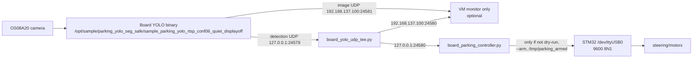

# Parking Chain Runtime Guide - 2026-06-27

This is the current operational understanding of the board-side parking chain
after synchronizing from the live board.

Evidence priority used here:

```text
live board files and runtime state
  > current synchronized local files
  > current configs
  > older docs
```

Older Chinese rebuild-plan docs may render as mojibake in this Windows shell, so
they are treated as design history unless their claims are confirmed by current
board code/config/runtime.

## 1. Current Physical / Runtime Topology



Network:

```text
Windows host: 192.168.137.1
Board eth0:   192.168.137.2
Ubuntu VM:    192.168.137.100 and 192.168.247.129
```

The VM is not in the control loop. It is monitor/debug only.

## 2. Current Idle State

Latest read-only check:

```text
board parking / YOLO / controller processes: not running
VM monitor / ROS parking processes: not running
/tmp/parking_armed: missing
/proc/umap/vb max_pool_cnt: 0
/dev/ttyUSB0: present
STM32 boot-link log: serial_ready, generic_fallback
```

Verdict:

```text
static assets: ready
perception chain: idle
controller chain: idle
motion chain: not armed
```

## 3. Authoritative Board Paths

Runtime code/config:

```text
/opt/parking/autopark/board_parking_controller.py
/opt/parking/autopark/board_start_yolo_closed_loop_monitor.sh
/opt/parking/autopark/board_yolo_udp_tee.py
/opt/parking/autopark/parking_action_library.json
/opt/parking/autopark/parking_action_response_model.json
/opt/parking/autopark/chassis_kinematics.json
/opt/parking/autopark/chassis_signs.json
/opt/parking/autopark/perception_filter.json
/opt/parking/autopark/parking_success_criteria.json
```

YOLO app/model:

```text
/opt/sample/parking_yolo_seg_safe/sample_parking_yolo_rtsp_conf06_quiet_displayoff
/opt/sample/parking_yolo_seg_safe/sample_parking_yolo_rtsp
/opt/sample/parking_yolo_seg_safe/parking_slot.om
```

Local synchronized copies:

```text
D:\parking_board_agent\tools\board_parking_controller.py
D:\parking_board_agent\tools\board_start_yolo_closed_loop_monitor.sh
D:\parking_board_agent\configs\*.json
```

## 4. Current Key Hashes

```text
20e6ab67ac068a20f37020bddeb2ec17f8817282be508bd75889ea0ef19fe4aa  board_parking_controller.py
fcc484842b1f35fe3c44db20ded128355c9b8be2abf509a9cbc55a0c62ceef81  board_start_yolo_closed_loop_monitor.sh
dfe83438886b29b9e7e56bba2b5f1ae8a8156c39b688758fb04c80d04d4c8d3a  board_yolo_udp_tee.py
129abb10752e606cdff17b8ea670eee04bf00e7bfb6f049de72ba1ee8a78b3b2  parking_action_library.json
dbcbd50f2b6fcaffa046b38467e83ab6ab58e75d59232ffe17a2fd7213b208b2  parking_action_response_model.json
e7a66731766a2bed2fb084bf1bbfb401e20e6533592afc0105441bcf6e6cecc4  chassis_kinematics.json
a74e702f505e98e25fa8346d4e72e468d30371458ed8f2d293af0540fda5bc27  chassis_signs.json
7ddfc88ebd09730487a2a7cc739a1494a45e0c9b529db69d9d79e1b2c88918e9  perception_filter.json

1f51690bdece18d28faeabda7bfa1936fa496fba8c8c10d79d4d4e76ba8cba74  sample_parking_yolo_rtsp_conf06_quiet_displayoff
8047faef69abd6f7034f994cc826572ea30f5642f99bd87c579431dbfbbaa7c4  sample_parking_yolo_rtsp
af27758f0383a7c5192558cb899a6500ca4ccfca9377dce356a8030fecab9dc5  parking_slot.om
```

## 5. Data Contract: YOLO Detection UDP

Controller entry:

```text
slot_infos_from_udp(raw)
```

Expected input:

```json
{
  "time_ns": 0,
  "detections": [
    {
      "class_name": "Parking",
      "confidence": 0.9,
      "mask_polygon": [[x, y], ...],
      "mask_area_px": 12345
    }
  ]
}
```

The controller ignores detections that:

- have class name outside `slot_class_names`;
- lack `mask_polygon`;
- cannot produce a valid quadrilateral geometry.

Processing pipeline in code:

```text
raw UDP JSON
  -> slot_infos_from_udp
  -> slot_pixel_geometry
  -> assess_slot_completeness
  -> SlotTargetSelector
  -> SlotStabilityFilter
  -> slot_relative_state
  -> action_replanner_command_from_state
```

Important current change from older code:

```text
current geometry uses quad_* fields from polygon/quadrilateral logic,
not old bbox_* as the authoritative planner state.
```

## 6. Control-State Representation

`slot_relative_state()` produces the replanner state used by
`--strategy action_replanner`. Important fields include:

```text
slot_x_err_px
slot_entry_x_err_px
slot_heading_err_deg
slot_lateral_cm
slot_y_dist_cm
line_margin_left_px
line_margin_right_px
min_margin_px
vision_confidence
vision_stability
phase
```

The current high-level phase buckets in configs/response model are:

```text
approach_entry
align_in_corridor
straighten_or_enter
```

## 7. Action Library and Response Model

Current action library:

```text
version: 2026-06-22-transition-reverse-templates
actions: 10
```

Actions:

```text
reverse_straight_6       ARC D=-6.0 STE=100 V=1    requires_measured=false
reverse_straight_4       ARC D=-4.0 STE=100 V=1    requires_measured=false
reverse_left_hard_6      ARC D=-6.0 STE=60  V=1    requires_measured=true
reverse_left_hard_4      ARC D=-4.0 STE=60  V=1    requires_measured=true
reverse_left_hard_3      ARC D=-3.0 STE=60  V=1    requires_measured=true
reverse_left_soft_6      ARC D=-6.0 STE=75  V=1    requires_measured=true
reverse_right_soft_6     ARC D=-6.0 STE=105 V=1    requires_measured=true
reverse_right_hard_6     ARC D=-6.0 STE=120 V=1    requires_measured=true
reverse_right_hard_4     ARC D=-4.0 STE=120 V=1    requires_measured=true
reverse_right_hard_3     ARC D=-3.0 STE=120 V=1    requires_measured=true
```

Current response model:

```text
schema: parking_action_response_model.v2
records: 18
legacy_records: 1
```

Scoring uses current state bucket, predicted deltas, margin penalty, confidence,
phase mismatch, uncalibrated penalty, and steering/switch penalties.

## 8. Chassis and Safety Configuration

Current signs:

```text
yaw_cw_positive=true
odom_d_reverse_negative=false
odom_x_right_positive=true
vision_lateral_left_negative=true
```

Current kinematics headline:

```text
servo_center_trim_ste=100
arc_min_effective_cmd_cm=3.0
arc_deadband_cm=1.95
move_deadband_cm=1.88
coast_after_done_cm=0.275
```

Current success criteria:

```text
done:
  slot_x_err_px_abs_max=15
  slot_heading_err_deg_abs_max=4.0
  slot_y_dist_cm_max=10.0
  min_margin_px_min=60
  required_stable_frames=3

abort:
  min_margin_px_floor=40
  vision_lost_sec=0.5
  max_total_cm=60
  max_steps=12
  divergence_x_err_px=200
```

Current perception filter:

```text
required_frames=5
gate_center_shift_cm=4.0
gate_yaw_shift_deg=8.0
hold_grace_sec=2.5
hold_max_frames=10
line_risk_debounce_frames=1
post_motion_guard_enabled=true
```

## 9. Motion Safety Gates in Current Code

The unique motion outlet is:

```text
send_motion(cmd, args, ...)
```

`send_motion()` rejects motion unless:

```text
not --dry-run
not (--strategy action_replanner --replanner-dry-run)
--arm is present
/tmp/parking_armed exists
command verb is MOVE / ARC / SERVO
```

`--strategy action_replanner --replanner-dry-run` is a no-motion mode:

```text
does not open serial
does not send SERVO
does not send MOVE / ARC
does not send STOP
```

In normal real-motion mode, startup calls:

```text
serial_setup()
read_stat()
```

No-motion replanner mode skips this serial setup.

## 10. Debugging Levels

Use these levels in order. Do not skip levels.

### L0 - Static / read-only

Already completed on 2026-06-27:

```text
board SSH
VM SSH
file/hash/config check
AST/JSON parse check
process/socket check
VB clean check
/tmp/parking_armed missing check
```

### L1 - Dynamic perception-only

Start only:

```text
board camera + YOLO + UDP tee
```

Do not start controller motion. Expected runtime effects:

```text
/tmp/parking_yolo_closed_loop_monitor.pid
/tmp/parking_yolo_udp_tee.pid
/tmp/parking_yolo_closed_loop_monitor.log
/tmp/parking_yolo_udp_tee.log
UDP 127.0.0.1:24579 from YOLO to tee
UDP 127.0.0.1:24580 from tee to controller port
UDP 192.168.137.100:24580 copied to VM
optional image UDP 192.168.137.100:24581
```

### L2 - Dynamic controller no-motion

Run:

```text
board_parking_controller.py --strategy action_replanner --replanner-dry-run
```

Expected:

```text
listens on 127.0.0.1:24580
logs candidate and replanner_step JSONL
does not open STM32 serial
does not send motion
```

Pass criteria:

```text
receives detections
stable frames achieved
replanner_step events present
chosen actions are explainable
will_execute_motion=false
send_to_stm32=false
no line-risk / no divergence / no geometry flip spam
```

### L3 - One-step real-motion only

Requires explicit operator presence and approval. Preconditions:

```text
L1 pass
L2 pass
manual scene check
STM32 query OK
/tmp/parking_armed created deliberately
--arm
max_motion_steps=1
max_total_cm tightly capped
log_jsonl set
final STOP on exit enabled
```

### L4 - Multi-step real parking

Only after repeated L3 successes. Still:

```text
short actions only
stop / observe / replan every step
human ready to interrupt
log every run
remove /tmp/parking_armed after run
```

## 11. Current Notable Operational Issue

`/opt/parking/autopark/board_start_yolo_closed_loop_monitor.sh` is currently
not executable (`-rw-r--r--`) on the board. It can be invoked safely as:

```sh
sh /opt/parking/autopark/board_start_yolo_closed_loop_monitor.sh
```

Restoring execute permission would require approval because `chmod` is a gated
operation.

## 12. Approval Commands for the Next No-Motion Dynamic Validation

These commands are intentionally listed but not executed without approval.

### 12.1 Start board perception-only YOLO + tee

Full command:

```powershell
.venv\Scripts\python.exe tools\board_auto_ssh.py run --host 192.168.137.2 --socket-timeout 1 --ssh-timeout 8 --command-timeout 45 --allow-risk "ACTION=start VM_HOST=192.168.137.100 sh /opt/parking/autopark/board_start_yolo_closed_loop_monitor.sh"
```

Purpose:

```text
Start the board camera/YOLO binary and UDP tee so detections go to
127.0.0.1:24580 and VM monitor address 192.168.137.100:24580.
```

Risk:

```text
Starts camera/NPU processes, writes /tmp PID/log files, creates/removes FIFO,
may stop previous YOLO processes, may run MPP cleanup if VB is dirty.
It does not start STM32 control and does not send motor/steering commands.
```

### 12.2 Run board action-replanner no-motion controller for 30 seconds

Full command:

```powershell
.venv\Scripts\python.exe tools\board_auto_ssh.py run --host 192.168.137.2 --socket-timeout 1 --ssh-timeout 8 --command-timeout 60 --allow-risk "/usr/local/bin/python3 /opt/parking/autopark/board_parking_controller.py --strategy action_replanner --replanner-dry-run --duration-sec 30 --stable-frames 5 --pixel-vision-lost-stop-sec 0.5 --listen-host 127.0.0.1 --listen-port 24580 --action-library-json /opt/parking/autopark/parking_action_library.json --response-model-json /opt/parking/autopark/parking_action_response_model.json --success-criteria-json /opt/parking/autopark/parking_success_criteria.json --chassis-signs-json /opt/parking/autopark/chassis_signs.json --require-fusion-signs --perception-filter-json /opt/parking/autopark/perception_filter.json --log-jsonl /tmp/parking_action_replanner_dryrun_20260627.jsonl"
```

Purpose:

```text
Validate the live detection -> slot state -> action_replanner scoring loop with
real YOLO detections, while guaranteeing no motion by --replanner-dry-run.
```

Risk:

```text
Starts a Python controller process, binds UDP 127.0.0.1:24580, writes a JSONL
log to /tmp. In this mode the code is designed not to open serial or send STM32
commands.
```

### 12.3 Stop board YOLO + tee after validation

Full command:

```powershell
.venv\Scripts\python.exe tools\board_auto_ssh.py run --host 192.168.137.2 --socket-timeout 1 --ssh-timeout 8 --command-timeout 45 --allow-risk "ACTION=stop sh /opt/parking/autopark/board_start_yolo_closed_loop_monitor.sh"
```

Purpose:

```text
Stop camera/YOLO and UDP tee processes created by the perception start script.
```

Risk:

```text
Sends INT/TERM to YOLO/tee processes and removes FIFO/PID files. No STM32
motion command is involved.
```

### 12.4 Optional VM monitor deployment/start

VM monitor files are not currently present in `/tmp`. Deploying or starting the
VM monitor requires additional write/start approval. It is optional for L1/L2
board-side no-motion validation because the controller can be validated entirely
on the board.

## 13. Post-Run Offline Analysis

After a board no-motion dry-run JSONL is downloaded or copied locally, analyze it
with:

```powershell
.venv\Scripts\python.exe tools\parking_dry_run_analyze.py artifacts\autopark_baseline\<run>.jsonl --summary-json artifacts\autopark_baseline\<run>_summary.json --curve-csv artifacts\autopark_baseline\<run>_curve.csv
```

The analyzer now includes `replanner_step` fields:

```text
replanner_step_events
replanner.chosen_actions
replanner.chosen_commands
replanner.chosen_origins
replanner.gate_true_counts
replanner.gate_false_counts
replanner.will_execute_motion_events
```

For L2 no-motion validation, `replanner.will_execute_motion_events` must be `0`.


## 14. Current Live Validation Status - 2026-06-27 14:02 CST

The board chain has now passed the no-motion L2 validation with the current
visible parking-slot scene:

```text
YOLO OS08A20 live inference -> UDP tee -> board controller 127.0.0.1:24580
-> slot_relative_state -> action_replanner -> no-motion send gate
```

Evidence is stored under:

```text
D:\parking_board_agent\artifacts\autopark_perception_debug_20260627\nomotion_replanner_1400\summary.json
D:\parking_board_agent\artifacts\autopark_perception_debug_20260627\udp_capture_windows\image_frame_000030_overlay_last_positive.jpg
```

Key result:

```text
candidate_events=75
stable_candidate_events=71
chosen_action=reverse_right_hard_6
chosen_command=ARC D=-6.0 STE=120 V=1
will_execute_motion_events=0
send_to_stm32_events=0
```

Therefore, from the current observed pose, the replanner's preferred first
short action is:

```text
ARC D=-6.0 STE=120 V=1
```

This is not permission to run real motion by default. For any real one-step
trial, re-check the scene live, keep the operator at the vehicle, create the arm
file only deliberately, run exactly one capped step, then immediately remove the
arm file and inspect the post-step observation.
