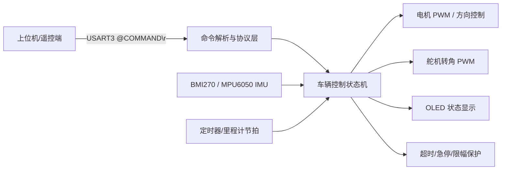
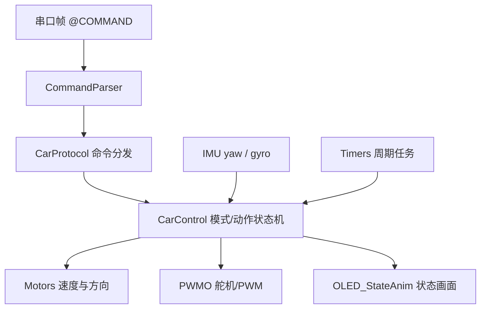

# car_6050_v2 核心代码整理说明

来源项目：`D:\code_space\IDE\Keil\STM32\FILES\car_6050_v2_copy`

整理目标：保留 STM32 智能小车固件的核心运行代码、构建入口、关键接口文档和上位机调试工具；排除编译产物、历史采集数据、临时缓存和大体量展示素材。

## 第一步：系统分析

本项目是基于 STM32F103 的遥控/自主小车底盘控制固件。系统通过串口接收上位机或遥控端命令，结合 IMU 姿态、编码/定时反馈和电机/舵机执行机构，实现手动控制、直行保持、定距行驶、相对转角和简单自主路线。



核心数据流：



## 第二步：模块划分

| 模块 | 目录/文件 | 职责 |
| --- | --- | --- |
| 应用入口 | `main.c`, `HARDWARE/CarApp.c`, `Core/CarApp.h` | 初始化外设、启动主循环、调度控制任务 |
| 协议与命令 | `Core/CarProtocol.*`, `Core/CommandParser.*` | 解析 `@COMMAND\r\n`，映射遥控/自主命令 |
| 运动控制 | `Core/CarControl.*`, `Core/HeadingControl.*` | 模式切换、直行保持、定距/转角动作、PID 参数 |
| 时间基准 | `Core/Timers.*` | 系统节拍、控制周期、超时依据 |
| 执行机构 | `HARDWARE/Motors.*`, `HARDWARE/PWMO.*` | 电机、舵机、PWM 输出 |
| 传感器 | `HARDWARE/BMI270/*`, `HARDWARE/MPU6050.*`, `DMP/*` | IMU 读取、滤波、姿态相关支持 |
| 人机与调试 | `HARDWARE/OLED*`, `HARDWARE/LED.*`, `HARDWARE/USART.*`, `vofa_config/*` | 显示、状态灯、串口日志/调试 |
| MCU 平台 | `USER/*`, `START/*`, `LIBS/*`, `RTE_Components.h` | 中断、CMSIS、STM32 标准外设库 |
| 构建入口 | `LED_1.uvprojx`, `build_gcc/*` | Keil 工程与 GCC 命令行构建 |
| 上位机辅助 | `py/exe/*`, `scripts/*` | 串口测试、蓝牙连接、命令发送 |

## 第三步：接口定义

串口命令帧格式：

```text
@COMMAND\r\n
```

关键命令族：

| 命令 | 含义 |
| --- | --- |
| `RC_MAN` | 进入手动模式 |
| `RC_STOP` / `AU_STOP` | 立即停车并回到待机 |
| `RC_HB` | 手动控制心跳 |
| `RC_STR` | 进入 IMU 直行保持 |
| `RC_SPDn` | 设置速度档位，`n=0..6` |
| `RC_STEx` | 设置舵机角度，固件限幅保护 |
| `RC_DSTx` | 行驶 `x` cm，负数表示倒车 |
| `RC_YAWx` | 相对当前 yaw 转向 `x` 度 |
| `RC_AUTO` / `AU_RUN` | 执行默认自主路线 |
| `ST_ER` | 急停/错误停止 |

内部主接口：

| 接口层 | 典型文件 | 集成关注点 |
| --- | --- | --- |
| 协议输入 | `CarProtocol.*` | 新命令应先定义解析和安全边界 |
| 控制状态 | `CarControl.*` | 新动作必须纳入状态机、超时和退出条件 |
| 执行输出 | `Motors.*`, `PWMO.*` | 所有速度/舵机输出需要经过限幅 |
| 传感反馈 | `BMI270/*`, `MPU6050.*` | 姿态坐标系、符号方向、滤波参数必须与底盘一致 |

## 第四步：实现路径

1. 先看 `README.md` 和 `CORE_CODE_README.md` 理解命令、状态、安全边界。
2. 从 `main.c` 进入 `CarApp_Init()` / `CarApp_Run()`，确认系统初始化顺序。
3. 沿 `USART -> CommandParser -> CarProtocol -> CarControl` 阅读控制链路。
4. 沿 `CarControl -> Motors/PWMO/OLED` 阅读执行与显示链路。
5. 若调整 IMU 或航向控制，优先检查 `BMI270/bmi270_driver.*`、`filter.*`、`HeadingControl.*`。
6. 构建验证优先使用 Keil 工程 `LED_1.uvprojx`；命令行可参考 `build_gcc/build.ps1`。

## 第五步：代码实现

本目录已经整理出的核心代码如下：

- `Core/`：车辆控制、协议解析、定时器、航向控制。
- `HARDWARE/`：电机、舵机、串口、OLED、IMU、按键、LED、I2C、滤波。
- `USER/`：中断与 STM32 标准库配置。
- `START/`：启动文件、CMSIS、系统时钟。
- `LIBS/`：STM32F10x 标准外设库。
- `DMP/`：MPU6050 DMP 支持代码。
- `build_gcc/`：GCC 构建脚本、链接脚本、启动文件。
- `py/exe/`、`scripts/`、`vofa_config/`：上位机调试和可视化辅助。
- `docs/`：命令参考、底盘测量计划、核心配置与 agent 规范。
- `FILELIST.txt`：本次整理后的完整文件清单。

未纳入内容：`Objects/`、`Listings/`、`build/`、`build_gcc` 输出产物、`data/` 历史采样数据、`.git/`、`.codex*`、`.vscode/`、`.eide/` 等临时或环境目录。
